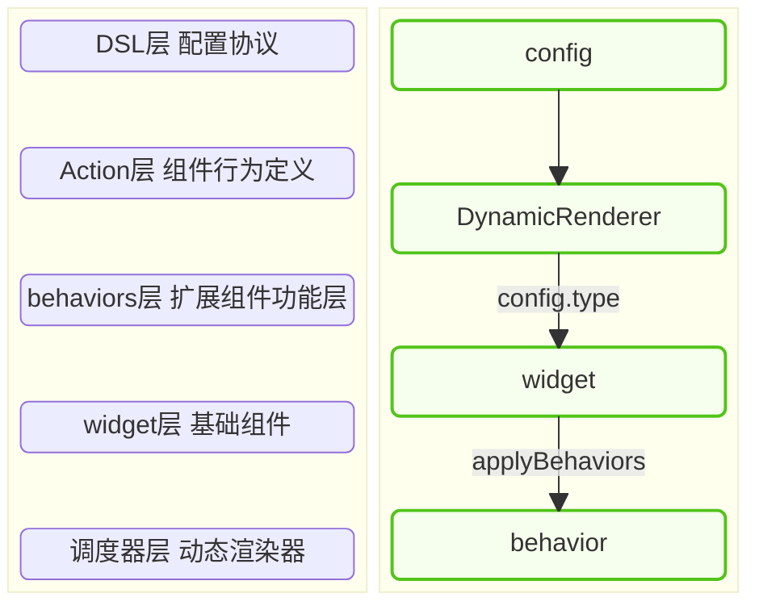

```mermaid
block
columns 2

%% 第一个块
block:架构图

%% 定义样式类
classDef flowchartNode fill:#f6ffed,stroke:#52c41a,stroke-width:2px,color:#333

  columns 1
  a1("DSL层 配置协议")
  space
  b1("Action层 组件行为定义")
  space
  c1("behaviors层 扩展组件功能层")
  space
  d1("widget层 基础组件")
  space
  e1("调度器层 动态渲染器")
end

%% 第二个块
block:流程图
  columns 1
  a2("config")
  space
  b2("DynamicRenderer")
  space
  c2("widget")
  space
  d2("behavior")
end


%% 第二个块的连接线
a2 --> b2
b2 --"config.type" --> c2
c2 --"applyBehaviors"--> d2

%% 应用样式类
class a2,b2,c2,d2 flowchartNode
```
